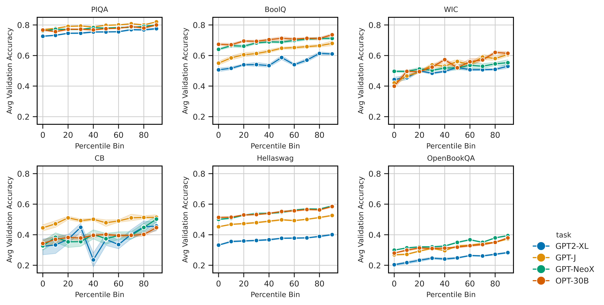

# In-context Learning Influences

[<a href="https://arxiv.org/abs/2302.11042">Paper</a>] [<a href="https://debugml.github.io/incontext-influences/">Blog post</a>] 

Official implementation for "In-context Example Selection with Influences".
We introduce *in-context influences* as a way to select examples for few-shot in-context learning.
Authors: [Tai Nguyen](https://taidnguyen.github.io/) and [Eric Wong](https://riceric22.github.io/).



### News
* Todo - Release influence scores for all tasks and baselines
* 04/18/2023 - Repository release
* 04/06/2023 - Blog post release

## Getting started
Create new conda environment using `environment.yml` with default name as "icl-influences".
```markdown
conda env create -f environment.yml
conda activate icl-influences
```
Alternatively, feel free to use `Dockerfile` to build your own Docker image.

## Usage
### Download data
Directory `data-train400-dev200` holds the subsampled data from our paper.
We conducted experiments on 9 [SuperGLUE](https://arxiv.org/abs/1905.00537) tasks.

To redownload the data from HuggingFace, please run the following command.
```markdown
python data_download.py
```
The script automatically samples a specified number of examples for train/dev/test data splits.

### Compute in-context influence scores
To compute in-context influences for a specific task and model, we first need to obtain a number of "training runs".

The following script 1) obtains the training runs, and 2) computes influence scores for both influence-based methods discussed in [Section 3.1](https://arxiv.org/pdf/2302.11042.pdf#subsection.3.1) in the paper.
By default, we write training run results to `out/` and influence scores to `influence_scores.jsonl`.

```markdown
python icl_influence.py --task=hellaswag \
                        --model_name_or_path=facebook/opt-6.7b \
                        --shot=46 \
                        --iterations=650 \
                        --cache_dir=<HF_CACHE_DIR>
```

In the above script, note that we pass in:
* `--shot`: The number of examples used in each few-shot prompt
* `--iterations`: The number of training runs evaluated on the Dev set
* `--cache_dir`: Directory for caching all models downloaded from HuggingFace

We recommend specifying a maximal number of shots that could fit in the context window.
This means that fewer iterations need to be run for good coverage of all train examples.

### Evaluate
After influence scores are computed, run evaluation as followed.
```markdown
python evaluate.py --task=hellaswag \
                   --model_name_or_path=facebook/opt-6.7b \
                   --split=test \
                   --method=incontext_influence_positive \
                   --cache_dir=<HF_CACHE_DIR>
```
By default, the script picks the top *k* maximal examples for each task.

### How to add your own data?
1. Add to `data_download.py` a method for downloading your own data. Keep the fields of your data similar to the current datasets.
2. Add the task type of your newly added task to `task_config.json`.
   1. If your task is neither multi-choice nor binary classification (ie. "free-form"), you should also modify inference and encode methos in `utils.py`.
3. Add your desired templates to `templates.py`.
4. Rerun the same pipeline.

### Models considered
We currently include working pipelines for 4 model families in `utils.py`: GPT-2, OPT, GPT-J/NeoX, and LLaMA. We load all models as 8-bit quantized wherever possible.
For [LLaMA](https://github.com/facebookresearch/llama), please include the path to your converted weights following the HF [official guide](https://huggingface.co/docs/transformers/main/model_doc/llama).

## Citation
If you find our work helpful, please cite:
```bibtex
@article{nguyen2023incontextinfluences,
  author = Nguyen, Tai and Wong, Eric,
  title = In-context Example Selection with Influences,
  journal = arXiv,
  year = 2023
}
```